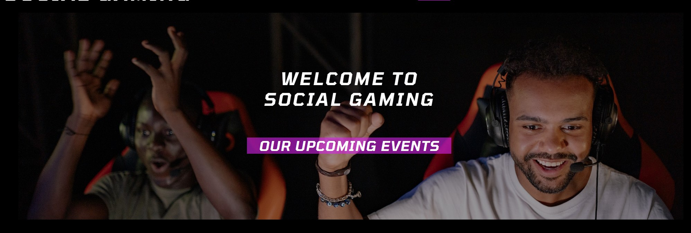
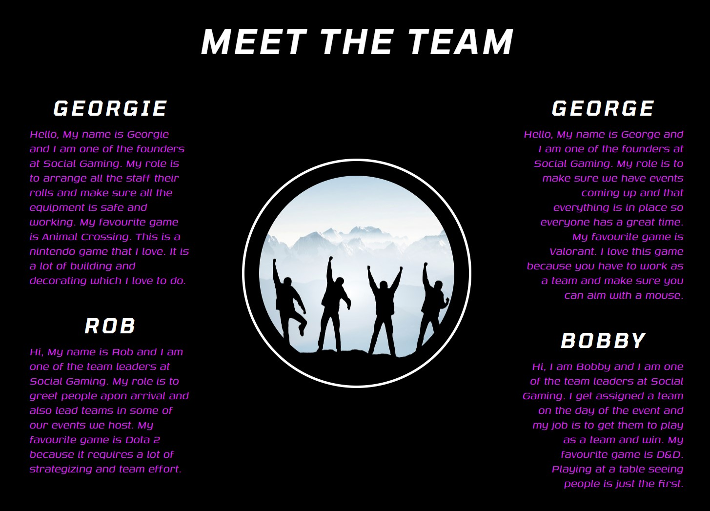
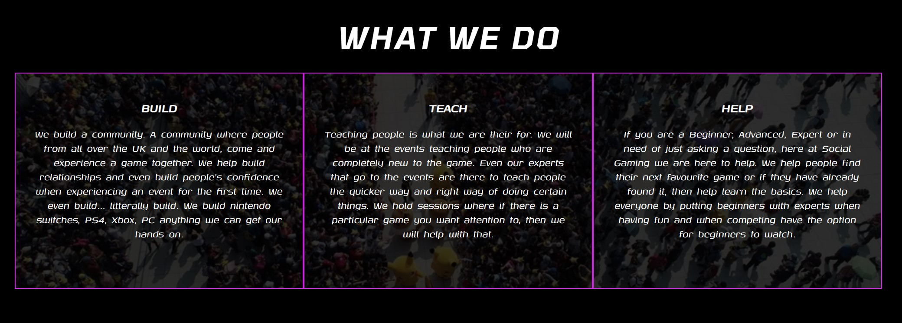
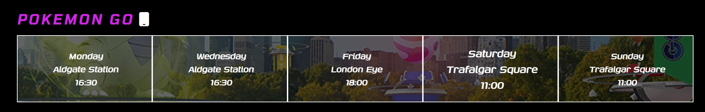
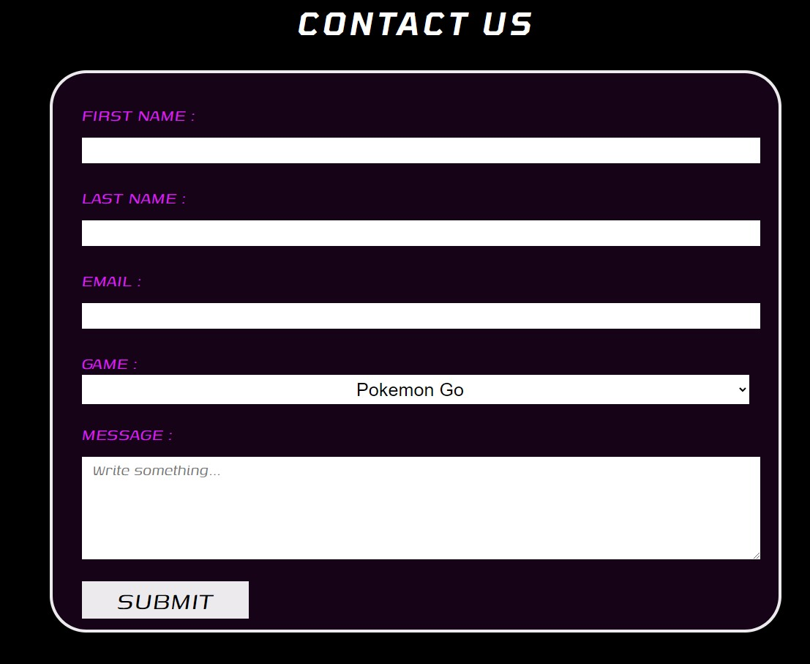
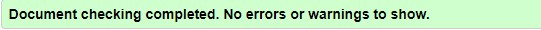
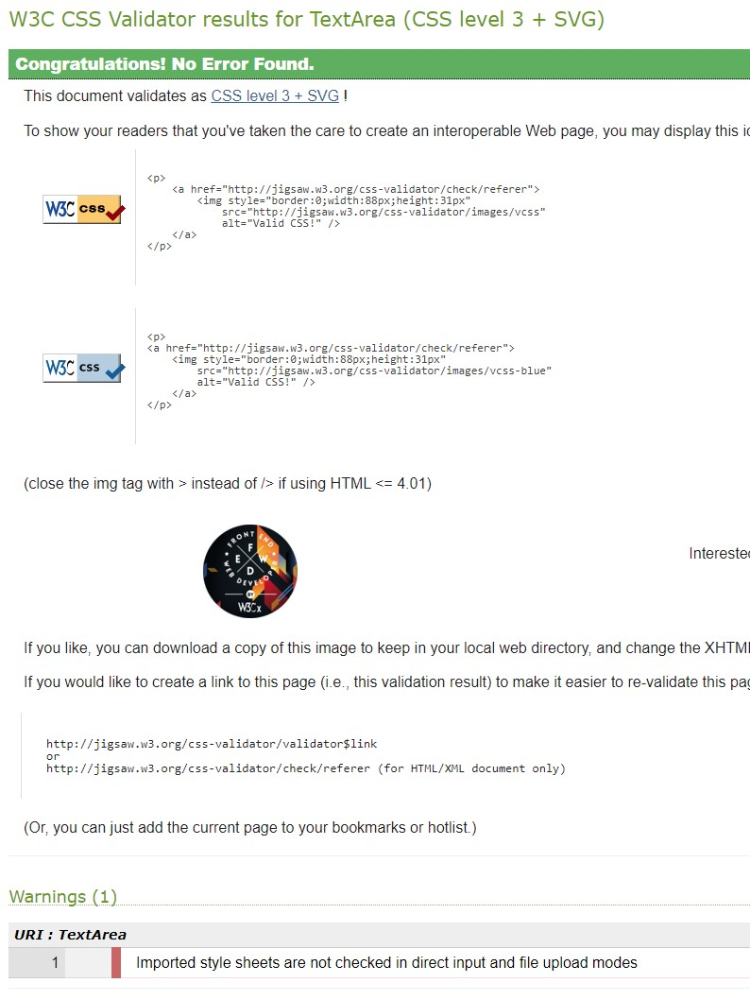

# Social Gaming

Social Gaming is a website for people who are looking to join a community of gamers who have the same passion as them.
This website will show people the dates of when the meetups will be happening and where they will be taking place. 
It will also give people the opportunity to contact the team to gain information or if they are having an issue then to report it.

The live website can be [found here.](https://georgeph0.github.io/Social-Gaming/)

## Table of Contents

- [User Experience](#user-experience)
- [Features](#features)
    - [Navbar](#navigation-bar)
    - [Hero Image](#hero-image)
    - [Home Page](#landing-page)
    - [Events](#events-page)
    - [Contact us Page](#contact-page)
    - [Footer](#footer)
- [Technologies](#technologies)
- [Testing](#testing)
    - [Validation](#validator-testing)
- [Bugs](#bugs)
- [Deployment](#deployment)
- [Credits](#credits)

## **User Experience**

### 1. First Time Visitor Goals

- a. As a First Time Visitor, I want to easily understand what the website is for and why.
- b. As a First Time Visitor, I want to Find information on what event to attend and on what day.
- c. As a First Time Visitor, I want to be able to navigate around the site to find the content they are looking for. 

### 2. Returning Visitor Goals

- a. As a Returning Visitor, I want to be able to See the updated events for the week quickly and easily.
- b. As a Returning Visitor, I want to be able to contact the team to find out more information or ask for help.
- c. As a Returning Visitor, I want to be able to access and view the website quickly and easily.

### 3. Frequent Visitor Goals

- a. As a Frequent Visitor, I want to be able to See the updated events for the week quickly and easily.
- b. As a Frequent Visitor, I want to be able to contact the team to give feedback on the events attended or ask questions.

## **Features**

### Navigation Bar

- The navigation bar is big and bold to be able to get people to notice the sites purpose quickly. The navigation has three
links to different pages, it includes a Home page, Events page and a Contact us page along with the logo in the top left corner.
The navigation bar is responsive to multiple screen sizes, as the screen gets smaller, the Home page, Events page and Contact us page
all move below the logo.

### Hero Image

- The landing area you will see a hero image and text. The hero image shows people playing a game together which identifies the purpose of the website.
The text infront of the image is to welcome the user to the website and also give them quick access to looking at the upcoming events, this will link
them to the events page. This fulfills the User Stories for First Time Visitor, as it shows them exactly where to go when landing on the page, and as for
Frequent Visitor, it helps them navigate quickly to where they want to go, being the schedule for meetups.

### Meet The Team

- The home page has the option to view the team behind the website. This gives them a chance to look at the people organizing and the people who will be there
when needed to be contacted. It gives a breif descripton of the person and their favourite game, this will make the user relate to the people and not feel intimidated.
This fulfills the User Stories Returning Visitor as it gives them an option to learn more about the team.

### What We Do

- This part of the home page is found at the bottom before the footer. This fulfills the User Stories Frequent Visitor and a Returning Visitor, as this will help them know
exacly what the team do and how they can help.  

### Events Page

- The events page provides information on which events are on, the dates of the events and the time that it starts. When a user hovers over the text of the day they want to go to,
the text will scale up, becoming bigger than the other texts on the screen to give the user a better chance of knowing the information they want.

### Contact Page

- The contact us page provides a form for users to fill out and if they have any questions about a specific game they can select that followed by a message box for them to fill out.
The form has three required fields, First Name, Last Name and Email. This is done so when sending a form to the team, they can see the name and email to respond to.

### Footer

- The footer is the same on all three of the pages and features the same links and icons. Icons and links are - Discord, YouTube, Twitch, Twitter and Facebook.

## **Technologies**

- [HTML](https://en.wikipedia.org/wiki/HTML): I used html, the main language of my project to add structure and content.
- [CSS](https://en.wikipedia.org/wiki/CSS): I used css to style my website.
- [Google Fonts](https://fonts.google.com/): I imported the fonts "Tomorrow" and "Genos".
- [Font Awesome](https://fontawesome.com/): I used this website for icons in the footer for social media links.
- [Am I responsive](https://ui.dev/amiresponsive): I used this website to check my website was responsive to different screen sizes.

## **Testing**

### Validator Testing

- [HTML Validation](https://validator.w3.org/)
    - result for index.html
        
    - result for events.html
        
    - result for contact-us.html
        

- [CSS Validation](https://jigsaw.w3.org/css-validator/)
    - result for style.css
        

### Compatibility

- Testing for compatibility were carried out on these browsers:
    - Chrome Version 111.0.5563.64
    - Firefox Version 110.0.1
    - Edge Version 110.0.1587.69
    - Safari macOS catalina Version 15.6.1

- Website compatibility
    - [Website mockup](./assets/readme-images/website-responsive.jpg)

## **Bugs**

When viewing on a mobile, the image at the bottom of the meet the team section would cause the circle to become an oval and the image will be of the sky. 
I fixed this by using css style display: none; which would remove the image for people using mobile.

## **Deployment**

- How this website was deployed:
    - 1. In GitHub repository, you navigate to the Settings tab and choose "Pages" on the left hand side.
    - 2. Make sure source section is "Deploy from a branch", then make sure "main" and "/root" is selected on the branch section and press save.
    - 3. Any changes being pushed through the "main branch" will be updated on the website.

- How to clone this website:
    - 1. Go to https://github.com/GeorgePh0/Social-Gaming on GitHub.
    - 2. Click "Code" next to the green button saying "Gitpod", then click HTTPS and copy the link.
    - 3. Open GitBash terminal and type "git clone" followed by the copied URL and press ENTER key.

## **Credits**

### Code

- Code on how to grow text on hover for the events text: [CSS scale on hover](https://css-tricks.com/snippets/css/scale-on-hover-with-webkit-transition/)

### Images

All images were taken from google images and sourced through websites.

- [Hero Image](https://www.pexels.com/photo/young-men-celebrating-while-playing-e-sports-9072331/)
- [Meet The Team circle](https://business-bulletin.co.uk/six-ways-to-build-a-winning-team)
- [What We Do](https://pokemongolive.com/post/tainan-safari-zone/)
- [Event page Pokemon go](https://www.eurogamer.net/pokemon-go-will-let-you-raid-with-friends-from-home)
- [Event page Warhammer](https://warhammer40000.com/)
- [Event page Dungeons & Dragons](https://ludusproducts.com/collections/dungeons-dragons)
- [Event page Board Games](https://www.reddit.com/r/AGOTBoardGame/comments/cjg1r0/game_of_thrones_a_dance_with_dragons_8_player/)
- [Event page PC Lounge](https://pcbang.uk/)

### Acknowledgements

- Thank you to my mentor Brian Macharia, he gave me very good advice, guided me to know how to execute my project and gave me resources on how to layout and implement certain pieces of code.